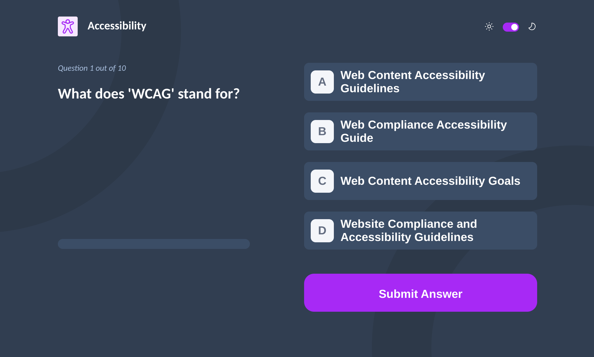
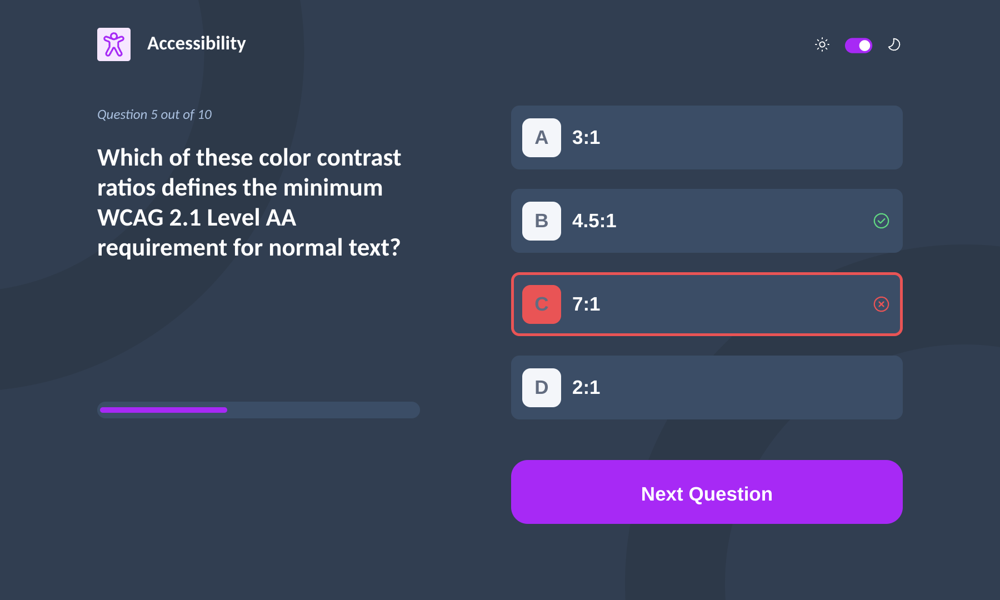
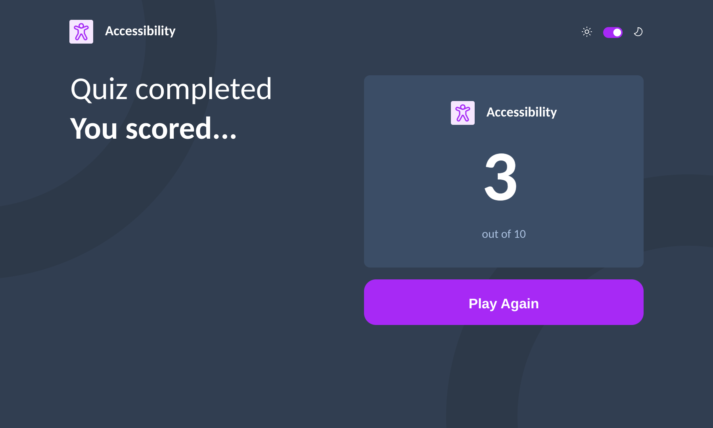

# Frontend Mentor - Frontend quiz app solution

This is a solution to the [Frontend quiz app challenge on Frontend Mentor](https://www.frontendmentor.io/challenges/frontend-quiz-app-BE7xkzXQnU). Frontend Mentor challenges help you improve your coding skills by building realistic projects.

## Table of contents

- [Overview](#overview)
  - [The challenge](#the-challenge)
  - [Screenshot](#screenshot)
  - [Links](#links)
- [My process](#my-process)
  - [Built with](#built-with)
  - [What I learned](#what-i-learned)
  - [Continued development](#continued-development)
  - [Useful resources](#useful-resources)
- [Contribute](#contribute)
- [Author](#author)
- [Acknowledgments](#acknowledgments)

## Overview

### The challenge

Users can:

- Select a quiz subject
- Select a single answer from each question from a choice of four
- See an error message when trying to submit an answer without making a selection
- See if they have made a correct or incorrect choice when they submit an answer
- Move on to the next question after seeing the question result
- See a completed state with the score after the final question
- Play again to choose another subject
- View the optimal layout for the interface depending on their device's screen size
- See hover and focus states for all interactive elements on the page
- Navigate the entire app only using their keyboard
- Change the app's theme between light and dark

### Screenshot

Menu


Quiz


Submit Answer


Results


### Links

- Solution URL: [Find the project source code on Github](https://github.com/edem8/quizend)
- Live Site URL: [Interact with App](https://techquiz-six.vercel.app/)

## My process

### Built with

- Semantic HTML5 markup
- Flexbox
- CSS Grid
- Mobile-first workflow
- Gitflow workflow
- [React](https://reactjs.org/) - JS library
- [Typescript](https://typescriptlang.org/) - Statically typed JS
- [Styled Components](https://styled-components.com/) - For styles

<<<<<<< HEAD
=======


>>>>>>> docs
### What I learned

Contrary to my thoughts, i found out that react setState() is an asynchronous function and hence using it in synchronous lines which need the updated state values almost immediately could be tricky...

```js
const [currentQuestion, setCurrentQuestion] = useState < number > 0;

const nextQuestionHandler = () => {
  const nextQuestion = currentQuestion + 1;
  console.log(nextQuestion); //Outputs 1

  setCurrentQuestion(nextQuestion); // setCurrentQuestion is async and hence doesnt update right away
  console.log(currentQuestion); // Outputs 0 instead of 1
};
```

Css :focus vs :focus-visible, if youre struggling with interactive elements focusing both on mouse clicks and keyboard naviagtions then :focus-visible takes care of that well at least for chrome browsers... i learnt that the hard way

```css
 /* focuses on both mouse and keyboard*/
:focus {
    border: 2px solid #d394fa;
    background-color: #d394fa;
    outline: none;
    ${(props) =>
      props.theme
        ? `box-shadow: 4px 4px 4px 0px ${props.theme.background.tertiary}`
        : null};
}

 /* focused on keyboard only...at least for me*/
:focus-visible {
    border: 2px solid #d394fa;
    background-color: #d394fa;
    outline: none;
    ${(props) =>
      props.theme
        ? `box-shadow: 4px 4px 4px 0px ${props.theme.background.tertiary}`
        : null};
}
```


### Continued development

- In future projects, I aim to deepen my understanding and mastery of React's state management, especially regarding asynchronous updates with setState() and where they should be called in the code base. This includes honing my skills in managing state updates across different components and ensuring smooth user interactions without relying on synchronous expectations.

- Explore more on component rendering based of change in state data versus react-routing (the merits, demerits and of course lazyly pick a side)


### Useful resources

- [Atlassian](https://www.atlassian.com/git/tutorials/comparing-workflows/feature-branch-workflow) - This platform's article on gitflow processes made my development process fairly smooth

- [Alex Hyett](https://youtu.be/hG_P6IRAjNQ?si=ScqUkzTddd66n_pR) - This is an amazing Youtuber who helped me understand the difference between the github flow and the gitflow. I'd recommend it to anyone who is not familiar with this concept or struggling with the difference.

- [Net Ninja](https://youtube.com/playlist?list=PL4cUxeGkcC9itC4TxYMzFCfveyutyPOCY&si=iAXwNT0rzIlpICuz) - I used a lot of griding in this project... Griding makes it very easy to define postions for elements on the DOM..This course by Net Ninja couldnt have explained it any better

- [Codevolution](https://youtube.com/playlist?list=PLC3y8-rFHvwgu-G08-7ovbN9EyhF_cltM&si=bMkfxYbtDfXxc3SV) - A short playlist on styled components...this got me started with styled components in less than an hour...I totally prefer styled componenets now..Yeah please join me!!!!!!

<<<<<<< HEAD
=======
## Contribute

- Create an issue
- Clone the repo and create a branch
- Run 
```sh
yarn install
```
- Create a pull request


>>>>>>> docs
## Author

- Github - [Kwaku Kwadwo Edem Bless](https://github.com/edem8)
- Frontend Mentor - [@edem8](https://www.frontendmentor.io/profile/edem8)
- Twitter - [@QhojoE](https://www.twitter.com/QhojoE)

## Acknowledgments

Thank you to [Amalitech Ghana](https://amalitech.org/) and everyone at the recuritment team for putting me on this challenge
